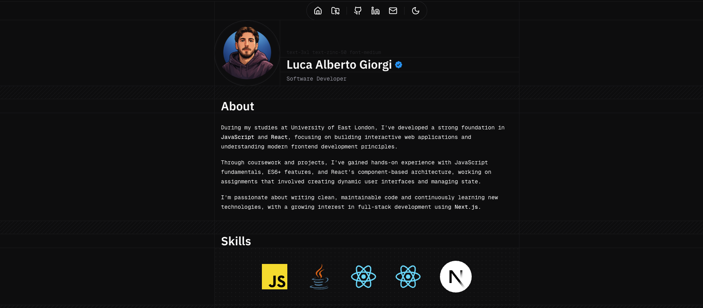

# Luca Alberto Giorgi Portfolio

A minimal, pixel-perfect portfolio to showcase my work as a Computer Science graduate and developer.

Live site: [www.lucagiorgi.com](https://www.lucagiorgi.com)

Repository: [lucaalberto-giorgi/portfolio](https://github.com/lucaalberto-giorgi/portfolio)

## Preview

## Overview

### Stack

- Next.js 16
- Tailwind CSS v4
- shadcn/ui

### Featured

- Clean & modern design
- Light/Dark themes
- vCard integration
- SEO optimized ([JSON-LD schema](https://json-ld.org), sitemap, robots)
- AI-ready with [/llms.txt](https://llmstxt.org)
- Spam-protected email
- Installable as PWA
- Analytics with [PostHog](https://posthog.com) & consent management via [c15t](https://c15t.com)

### Analytics

User behavior tracking with [PostHog](https://posthog.com) to understand how visitors interact with the site:

- **Engagement** - Monitor name pronunciation plays
- **User actions** - Navigation, theme changes, content interactions

Built with privacy in mind:

- Consent management via [c15t](https://c15t.com)
- Cookieless mode until consent
- Production-only tracking
- Type-safe event schema with Zod

## Development

Please refer to the [Development Guide](./DEVELOPMENT.md) for more details.

## License

Licensed under the [MIT license](./LICENSE).

You're free to use my code! Just make sure to <ins>remove all my personal information</ins> before publishing your website. It's awesome to see my code being useful to someone!

## Contributors

## Acknowledgments

- [React](https://react.dev)
- [Next.js](https://nextjs.org)
- [Tailwind CSS](https://tailwindcss.com)
- [Radix UI](https://www.radix-ui.com)
- [Base UI](https://base-ui.com)
- [Motion](https://motion.dev)
- [shadcn/ui](https://ui.shadcn.com)
- [Aceternity UI](https://ui.aceternity.com)
- [Kibo UI](https://www.kibo-ui.com)
- [Lucide](https://lucide.dev)
- [Fumadocs](https://fumadocs.dev)
- [PostHog](https://posthog.com)
- [c15t](https://c15t.com)
- And many other open-source libraries used in `package.json`
